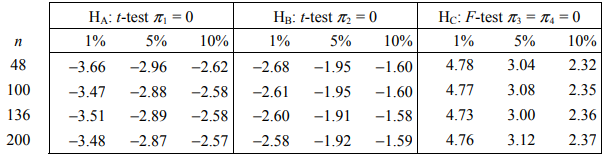
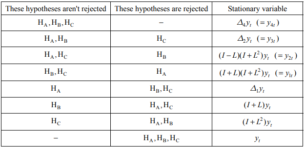

In this paper, an attempt will be made to forecast the value of Gross Domestic Product for the United Kingdom of Great Britain and Northern Ireland for the fourth quarter of 2021. For this purpose, the country's historical GDP data in the form of a time series will be used, covering the range from the first quarter of 1955 to the third quarter of 2021.

The data is contained in the file `gdp_uk.xlsx` and contains 267 observations. For each of them, the values of two variables were given:

-   date -- year and quarter,
-   gdp -- GDP value in million GBP, in current prices, not seasonally adjusted.

The data comes from the resources of [Office for National Statistics](https://www.ons.gov.uk/).

```{r, setup, include=FALSE}
# default settings of code chunks
knitr::opts_chunk$set(echo=FALSE, comment= " ")

# libraries
library(readxl)     # for xlsx loading
library(tidyverse)  # vide range analytical tools
library(zoo)        # conversion to time series
library(urca)       # ADF test with restrictions
library(car)        # Linear restrictions test
library(moments)    # additional descriptive statistics 
library(forecast)   # forecasting
library(strucchange)# CUSUM tests

# data loading
df_raw <- read_excel("gdp_uk.xlsx")
df <- df_raw[101:267,]
```

The scope of the data was limited by removing the observations to the 1st quarter of 1980 to eliminate the values disturbing the desired series characteristics.

# Initial analysis
Descriptive statistics for the `gdp` variable:

```{r}
summary(df$gdp)
stats <- cbind(sd(df$gdp),(sd(df$gdp) / mean(df$gdp) * 100),skewness(df$gdp),kurtosis(df$gdp))
colnames(stats) <- c("SD","CV","Skewness","Kurtosis")
rownames(stats) <- " "
stats
```

The time series average is £ `294,553`m with a standard deviation of £ `153,515`m. The middle value of the series is £ `280,461`m. The smallest value in the series is £ `61,022`m and the highest is £ `584,928`m. The middle 50% of the series is between the first and third quartiles of £ `167,071`m and £ `412,376`m, respectively. The volatility coefficient is `52.12`, which means the average volatility. A skewness of `0.2` means a slightly right-asymmetric distribution. A positive kurtosis of `1.83` indicates a high concentration of the values around the mean.
 
```{r fig.height=4, fig.width=5, fig.align='center', fig.cap="Chart 1. United Kingdom GDP in 1980-2021"}
fmt <- "%Y Q%q"
df$date <- as.yearqtr(df$date, format = fmt)
ggplot(df) +
  geom_line(aes(x = date, y = gdp), color = 'red') +
  scale_x_yearqtr(format = fmt) +
  scale_y_continuous(labels = scales::comma) +
  labs(y = "GDP",
       x = "Time") +
  theme_bw()
```

The chart shows a relatively steady upward trend with two major collapses around 2008 and 2020.

# Determining time series stationarity

### Augmented Dickey Fuller test for integration

> $H_0: \rho = 0$, $y_t$ it is not a stationary process

> $H_1: \rho < 0$, $y_t$ is a stationary process

```{r}
# Function to summarize the ADF variants
adf_summary <- function(x) {
  adf_none  <-  ur.df(x, lags = 8, type='none', selectlags = c("AIC"))
  adf_drift <-  ur.df(x, lags = 8, type='drift', selectlags = c("AIC"))
  adf_trend <-  ur.df(x, lags = 8, type='trend', selectlags = c("AIC"))
  print("ADF without trend and constant")
  print(cbind(t(adf_none@teststat), adf_none@cval))
  print("ADF with constant")
  print(cbind(t(adf_drift@teststat), adf_drift@cval))
  print("ADF with constant and trend")
  print(cbind(t(adf_trend@teststat), adf_trend@cval))
}
```

#### For unchanged data

```{r}
adf_summary(df$gdp)
```

Without taking into account the intercept and the trend, the test statistic `tau1 = 3.47` is greater than the critical value `-1.95`, which means that at the significance level of 5% there is no reason to reject the null hypothesis of non-stationarity of the series.

Taking into account the intercept, the test statistic `tau2 = 1.61` is greater than the critical value `-2.88`, which means that at the significance level of 5% there are no grounds to reject the null hypothesis of non-stationarity of the series.

Taking into account the intercept and the trend, the test statistic `tau3 = -2.01` is greater than the critical value `-3.43`, which means that at the significance level of 5% there are no grounds to reject the null hypothesis of series non-stationarity.

#### For first seasonal differences

```{r}
diff1 <- as.vector(diff(df$gdp, lag = 4))
adf_summary(diff1)
```

Without taking into account the intercept and the trend, the test statistic `tau1 = -0.98` is greater than the critical value `-1.95`, which means that at the significance level of 5% there is no reason to reject the null hypothesis of non-stationarity of the series.

Taking into account the intercept, the test statistic `tau2 = -3.05` is lower than the critical value `-2.88`, which means that at the significance level of 5% we reject the null hypothesis of non-stationarity of the series.

Taking into account the intercept and the trend, the test statistic `tau3 = -5.39` is lower than the critical value `-3.43`, which means that at the significance level of 5% we reject the null hypothesis of non-stationarity of the series.

From the above tests it appears that the series is stationary after the first differentiation, $X_t \sim {\sf I}(1)$.

\newpage

### HEGY test for seasonal integration

> $H_A: \pi_1 = 0$, $y_t$ is non-stationary, non-seasonal

> $H_B: \pi_2 = 0$, $y_t$ is a non-stationary process with two-period seasonality

> $H_C: \pi_3 = \pi_4 = 0$, $y_t$ is a non-stationary process with four-period seasonality

```{r, warning=FALSE}
# the lags use the full range of data (df_raw) so that there are no null values
y1 <- head(df$gdp + df_raw[100:267,]$gdp + df_raw[99:267,]$gdp + df_raw[98:267,]$gdp,-3)
y2 <- -(head(df$gdp - df_raw[100:267,]$gdp + df_raw[99:267,]$gdp - df_raw[98:267,]$gdp,-3))
y3 <- head(df$gdp - df_raw[99:267,]$gdp,-2)
y4 <- head(df$gdp - df_raw[97:267,]$gdp,-4)

y1_1 <- lag(y1, n = 1)[-1:-4]
y2_1 <- lag(y2, n = 1)[-1:-4]
y3_1 <- lag(y3, n = 1)[-1:-4]
y3_2 <- lag(y3, n = 2)[-1:-4]
y4_1 <- lag(y4, n = 1)[-1:-4]
y4_2 <- lag(y4, n = 2)[-1:-4]
y4_3 <- lag(y4, n = 3)[-1:-4]
y4_4 <- lag(y4, n = 4)[-1:-4]

lm1 <- lm(y4[-1:-4] ~ y1_1 + y2_1 + y3_1 + y3_2 + y4_1 + y4_2 + y4_3 + y4_4)
summary(lm1)

linearHypothesis(lm1, c("y3_1 = 0","y3_2 = 0"))
```

(ref:rudolph) [@hylleberg1990].

```{r, fig.align="center", out.height="40%", out.width="60%", fig.cap='Table 1. HEGY test critical values for quarterly data (ref:rudolph)'}

```

The t-test statistic for $y_1 (-1)$ variable `2.51` is greater than the critical value `-2.89`, which means that at the significance level of 5% there are no grounds to reject the hypothesis of non-seasonal non-stationarity.

The t-test statistic for $y_2 (-1)$ variable `-3.46` is lower than the critical value `-1.91`, which means that at the significance level of 5%, we reject the hypothesis of two-period seasonal non-stationarity.

The F-test statistic for the variables $y_3 (-1)$ and $y_3 (-2)$ `0.16` is lower than the critical value `3.00`, which means that at the significance level of 5% there are no grounds to reject the hypothesis of four-period seasonal non-stationarity.

```{r, fig.align="center", out.height="40%", out.width="60%", fig.cap='Table 2. HEGY test hypothesis combinations (ref:rudolph)'}

```

Based on the table above, it can be concluded that the series is characterized by a semi-annual stationarity.

# Seasonal ARIMA model

Based on the tests performed above, it can be determined that the parameters `d` and `D` in the `SARIMA(p,d,q)(P,D,Q)` model will have the value of `1`. The optimal values of the remaining parameters are not known, therefore several models with parameter values from `0` to `2` will be estimated.
\newpage
```{r}
# SARIMA model
# Conversion to time series object
dfts <- ts(df$gdp, start = c(1980,1), end = c(2021,3), frequency = 4)

# Models estimation
m1 <- Arima(dfts, order = c(2,1,2), seasonal = c(2,1,2))
m2 <- Arima(dfts, order = c(2,1,2), seasonal = c(1,1,2))
m3 <- Arima(dfts, order = c(2,1,2), seasonal = c(1,1,1))
m4 <- Arima(dfts, order = c(2,1,1), seasonal = c(1,1,1))
m5 <- Arima(dfts, order = c(1,1,1), seasonal = c(1,1,1))
m6 <- Arima(dfts, order = c(1,1,1), seasonal = c(0,1,1))
m7 <- Arima(dfts, order = c(0,1,1), seasonal = c(0,1,1))

# Model comparison - the Akaike criterion
wnk <- cbind(2,1,2,2,1,2,m1$aic)
wnk <- rbind(wnk, c(2,1,2,1,1,2,m2$aic))
wnk <- rbind(wnk, c(2,1,2,1,1,1,m3$aic))
wnk <- rbind(wnk, c(2,1,1,1,1,1,m4$aic))
wnk <- rbind(wnk, c(1,1,1,1,1,1,m5$aic))
wnk <- rbind(wnk, c(1,1,1,0,1,1,m6$aic))
wnk <- rbind(wnk, c(0,1,1,0,1,1,m7$aic))
colnames(wnk) <- c("p","d","q","P","D","Q","AIC")
rownames(wnk) <- c("M1","M2","M3","M4","M5","M6","M7")
wnk
```

From the above array it can be concluded that, based on the Akaike criterion, the best model is the `Model 6`.

```{r}
# Model 6 and forecast
fc <- forecast(m6, h=1, level = 95)
summary(fc)
fsd <- (fc$upper[,1] - fc$lower[,1]) / (2 * qnorm(.5 + fc$level[1] / 200))
cat("Standard error: ", fsd)
```

The GDP forecast for the fourth quarter of 2021 for the United Kingdom is £ `593756.3`m with an average estimate error of £ `7947.523`m, which is `1.3%` of the forecast value, which proves that the forecast is acceptable.

The range `<578179.4;609333.1>` has a 95% probability to cover the unknown United Kingdom GDP for the fourth quarter of 2021.

Based on the arithmetic mean of the forecast error, our forecasts were on average £ `677.247`m too low in relation to the real GDP value, which is on average `0.278%` of the forecasted variable, which proves that the forecast is not biased.

The value of the GDP forecast deviates from the true value by an average of £ `3455.684`m, with forecast errors averaging `1.07%` of the true value, which proves that the forecasts are acceptable.

```{r fig.height=3, fig.width=7, fig.align='center', fig.cap="Chart 2. United Kingdom GDP forecast"}
autoplot(as.zoo(m6$x), geom = "line") + 
  autolayer(m6$x, series = "PKB") +
  autolayer(fitted(m6), series = "prognoza") + 
  autolayer(forecast(m6,h=1), series = "przedział ufności") + 
  scale_x_yearqtr() + 
  scale_y_continuous(labels = scales::comma) +
  labs(y = "",x = "") +
  theme_bw()
```

### CUSUM stability test

From Chart 3, it can be concluded that the model is suitable for forecasting because the plot of the cumulative sums has not exceeded the confidence interval.

Based on Chart 4, it can be concluded that the model is characterized by an unstable inference precision.

```{r fig.cap="Chart 3. CUSUM and Chart 4. CUSUM-SQ", fig.show="hold", fig.height=6, out.width="49%", out.height="49%"}
# CUSUM
ma <- as.vector(m6$residuals)
ma <- ma[-1]
ma_1 <- lag(ma, n = 1)[-1:-4]
ma_4 <- lag(ma, n = 4)[-1:-4]

d1gdp <- df$gdp - lag(df$gdp, n = 1)
d1gdp <- d1gdp[-1]

d1s1gdp <- d1gdp - lag(d1gdp, n = 4)
d1s1gdp <- d1s1gdp[-1:-4]

cusum <- efp(d1s1gdp ~ ma_1 + ma_4, type = "Rec-CUSUM")
plot(cusum, main = "")

# CUSUM-SQ
# squares of recursive residuals
rr2 <- recresid(d1s1gdp ~ ma_1 + ma_4)^2
# CUSUM process
sr <- ts(cumsum(c(0, rr2))/sum(rr2), freq = 4)
# confidence intervals
border <- ts(seq(0, 1, length = length(sr)), start = start(sr), freq = 4)
# plot
plot(sr, xaxs = "i", yaxs = "i", main = NULL, type = "o", col = 3)
lines(border, lty = 3, lwd = 2)
lines(0.2 + border, col = 2, lwd = 2)
lines(- 0.2 + border, col = 2, lwd = 2)
```

\newpage

### Chow stability test

> $H_0: \beta_1 = \beta_2$

> $H_0: \beta_1 \neq \beta_2$

```{r}
# Chow test
sctest(d1s1gdp ~ ma_1 + ma_4, type = "Chow")
```

The `p-value` is greater than the significance level of 5% which means there is no structural break. The same conclusion can be drawn from the graph of the QLR test.

```{r fig.height=4, fig.width=5, fig.align='center', fig.cap="Chart 5. QLR test for structural break"}
# QLR test
qlr <- Fstats(d1s1gdp ~ ma_1 + ma_4)
plot(qlr,alpha=0.05)
```

# Bibliography
